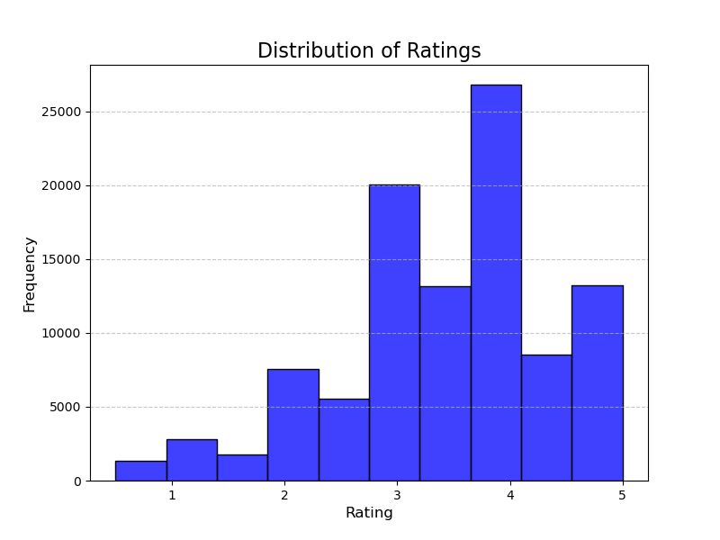
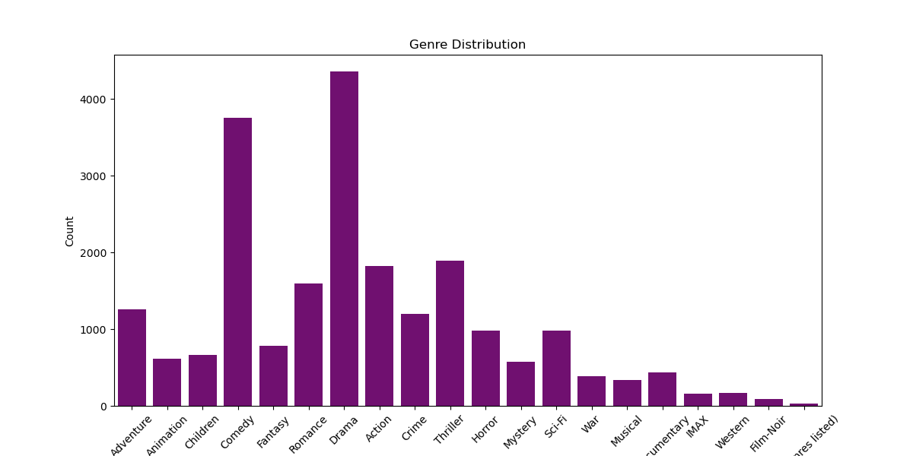
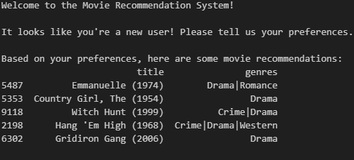

# Movie Recommendation System

# Project Overview

This project invlolves building movie recommendation system using the MovieLens dataset. The system leverages collaborative filtering, content-based filtering, and hybrid approaches to generate personalized movie recommendations.

# Workflow

# Business understanding

Paramount studios would like to increase their viewship and user traffic on their paramount plus platform. TO increase engagement, they want to recommend certain movie titles to their current user and new user based.

In order to determine the best movies for users, we will create a recommendation system based on users viewship history for current subscribers, 
and possible recommedations for new accounts who signed up for the platform.

* Identifiy the real-world problem of content discovery in streaming services.

# Data and Methodology

**Data Understanding**

* Explored the MovieLens dataset, including size, features, and limitations.

* Conduct initial exploratory data analysis (EDA).

Data used for this project is obtained from MovieLens, which contains explicit user ratings for movies along with metdata such as titles, genres, and timestamps. 

The data contains three datasets that we will use to create our recommendation system:
1.  Links.csv: maps movieId to external IDs. (9,743 imdbID and tmbdID)
2.  Movies.csv: Contains movie metadata, title, and genres. (9,743 movie selections)
3.  ratings.csv: Includes user ratings of movies, with columns: userId, movieId, rating, and timestamp. (100,000+ reported ratings)

**Data Preparation**

* Clean and preprocessed data (missing values, encoding categorical variables)

* Engineer features for improved model performance

Visualizations can be found here .

The datasets can located in the following link:

[MovieLens](https://grouplens.org/datasets/movielens/latest/)

# EDA

During my initial analysis, I analyzed user and movie statistics. Visualized sparsity and distribution of ratings. Then plotted a heatmap of user-movie ratings to identify patterns.

# Models

# Evaluation & Insights

* Compare different recommendations approaches.
* Discuss trade-offs between accuracy, scalability, and interpretation

# Conclusion
Using collaborative filtering approach implementing leveraging user-based or item-based similarities to recommend top 5 movies for each user. To address the cold start problem, a hybrid model combines collaborative filtering with content-based filtering, incorporating movie metadata.

To provide personalized movie recommendations, we consider their historical data or the historical data of others based on ratings for new users to ensure tailore recommendations.

The model's performance is assessed using Root Mean Squared Error (RMSE) to measure prediction accuracy. Additionally, due to the sparsity within the matrix, Precision and Recall are not used to evaluate the ranking effectiveness of the recommendations.

# For more information

See the full analysis in the [Jupyter Notebook](https://github.com/omendez930/Phase4-movie-recommendation/blob/main/movie_recommendation_system.ipynb) and [Presentation](/presentation.pdf)

If you're interested in the visualizations, you can check it out here: [Tableau link](https://public.tableau.com/app/profile/orangel.mendez/viz/Movie_recommendation_system/Dashboard1?publish=yes)

Orangel Mendez: <omendez30@gmail.com>